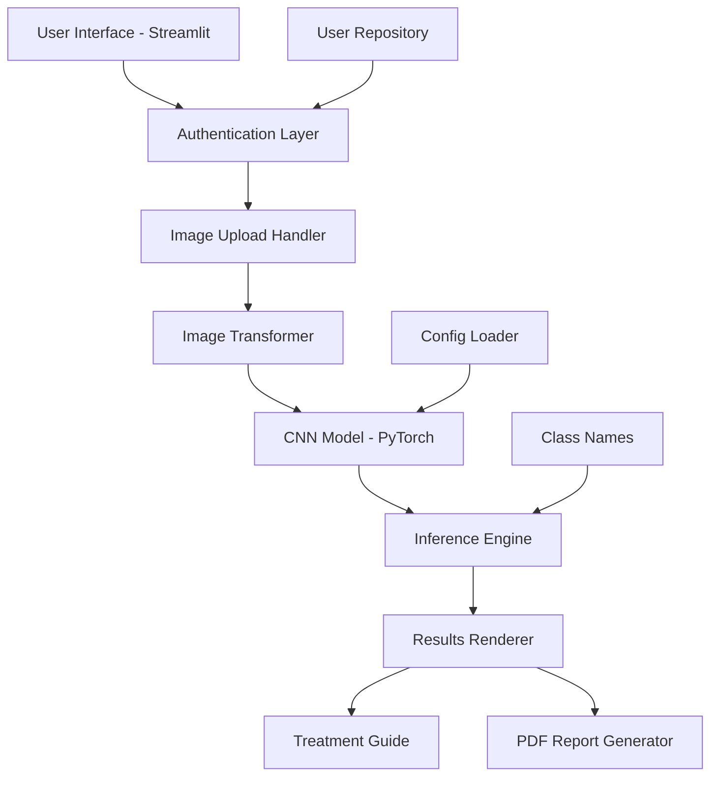

# 🌾 AI-Powered Crop Disease Diagnosis System

[](https://www.python.org/)
[](https://pytorch.org/)
[](https://streamlit.io/)
[](LICENSE)

An intelligent web application that uses deep learning to diagnose diseases in rice and pulse crops through image analysis. Built with PyTorch and Streamlit, this system provides farmers and agricultural professionals with instant, accurate disease identification and treatment recommendations.


---

## 📋 Table of Contents

- [Features](#-features)
- [Demo](#-demo)
- [Architecture](#-architecture)
- [Installation](#-installation)
- [Usage](#-usage)
- [Project Structure](#-project-structure)
- [Model Details](#-model-details)
- [SOLID Principles](#-solid-principles)
- [API Documentation](#-api-documentation)
- [Testing](#-testing)
- [Configuration](#-configuration)
- [Contributing](#-contributing)
- [License](#-license)

---

## ✨ Features

### Core Functionality
- 🔬 **AI-Powered Disease Detection**: Deep learning CNN model for accurate crop disease identification
- 📸 **Image Upload & Analysis**: Support for JPEG, PNG formats with real-time processing
- 📊 **Confidence Scoring**: Probability scores for top-3 disease predictions
- 💊 **Treatment Recommendations**: Comprehensive treatment guides with fertilizer suggestions and purchase links
- 📑 **PDF Report Generation**: Downloadable diagnosis reports with images and recommendations

### User Experience
- 🔐 **Secure Authentication**: User registration and login with bcrypt password hashing
- 🎨 **Modern UI/UX**: Beautiful gradient design with glassmorphism effects
- 📱 **Responsive Design**: Works seamlessly on desktop and mobile devices
- 🌙 **Dark Mode Sidebar**: Professional green-themed sidebar with white main content

### Technical Features
- 🏗️ **SOLID Architecture**: Clean code following all 5 SOLID principles
- 🧪 **Comprehensive Testing**: Unit tests with pytest and hypothesis
- 🔧 **Configurable**: JSON-based configuration for easy customization
- 📦 **Modular Design**: Separation of concerns with clear interfaces

---

## 🎬 Demo

### Login & Authentication
```
Username: admin
Password: admin123
```

### Supported Diseases
- 🌾 **Bacterial Leaf Blight** (Rice)
- 🍂 **Brown Spot** (Rice)
- 🌿 **Leaf Scald** (Rice)

---

## 🏗️ Architecture

### System Components



### Technology Stack

| Component | Technology |
|-----------|-----------|
| **Frontend** | Streamlit |
| **Backend** | Python 3.8+ |
| **Deep Learning** | PyTorch 2.0+ |
| **Computer Vision** | torchvision |
| **Image Processing** | Pillow |
| **Authentication** | bcrypt |
| **PDF Generation** | ReportLab |
| **Testing** | pytest, hypothesis |

---

## 🚀 Installation

### Prerequisites
- Python 3.8 or higher
- pip package manager
- Virtual environment (recommended)

### Step-by-Step Setup

1. **Clone the Repository**
```bash
git clone <repository-url>
cd cnn-pytorch-main
```

2. **Create Virtual Environment**
```bash
# Windows
python -m venv venv
venv\Scripts\activate

# Linux/Mac
python3 -m venv venv
source venv/bin/activate
```

3. **Install Dependencies**
```bash
pip install -r requirements.txt
```

4. **Verify Installation**
```bash
python -c "import torch; print(f'PyTorch version: {torch.__version__}')"
python -c "import streamlit; print(f'Streamlit version: {streamlit.__version__}')"
```

---

## 💻 Usage

### Running the Application

```bash
streamlit run app.py
```

The application will open in your default browser at `http://localhost:8501`

### Using the System

1. **Login/Register**
   - Use demo credentials (admin/admin123) or create a new account
   - Passwords are securely hashed with bcrypt

2. **Upload Image**
   - Click "Choose an image file" in the main area
   - Select a clear image of a crop leaf (JPEG/PNG)
   - Preview the uploaded image

3. **Analyze**
   - Click "🚀 Analyze Image" button
   - Wait for the AI model to process the image
   - View diagnosis results with confidence scores

4. **Review Treatment Guide**
   - Expand the "Treatment Guide" section
   - Read disease overview and prevention tips
   - View recommended fertilizers with purchase links
   - Check important advisory and references

5. **Download Report**
   - Click "💾 Download Results"
   - Choose between Text or PDF format
   - Save the report for your records

### Training a New Model

```bash
cd scripts
python train_model.py
```

### Testing an Image

```bash
cd scripts
python test_image.py --image_path ../data/test_images/sample.jpg
```

---

## 📁 Project Structure

```
cnn-pytorch-main/
│
├── app.py                          # Main Streamlit application
├── requirements.txt                # Python dependencies
├── README.md                       # This file
│
├── config/                         # Configuration files
│   ├── model_config.json          # Model architecture & hyperparameters
│   └── class_names.json           # Disease class labels
│
├── src/                           # Source code modules
│   ├── __init__.py
│   ├── model.py                   # CNN model architecture
│   └── transforms.py              # Image preprocessing pipeline
│
├── scripts/                       # Utility scripts
│   ├── train_model.py            # Model training script
│   ├── test_image.py             # Single image testing
│   └── README.md                 # Scripts documentation
│
├── models/                        # Trained model weights
│   └── crop_disease_model.pth    # Pre-trained model
│
├── data/                          # Datasets and test images
│   └── test_images/              # Sample test images
│
├── tests/                         # Test suite
│   ├── test_transforms.py        # Image transformation tests
│   └── test_model.py             # Model architecture tests
│
├── docs/                          # Documentation
│   ├── SRP_Documentation.md      # Single Responsibility Principle
│   ├── OCP_Documentation.md      # Open/Closed Principle
│   └── DIP_Documentation.md      # Dependency Inversion Principle
│
├── interfaces.py                  # Abstract interfaces (SOLID)
├── config_loader.py              # Configuration management
├── user_repository.py            # User data persistence
├── treatment_guide.py            # Disease treatment information
└── pdf_report_generator.py       # PDF report creation
```

---

## 🧠 Model Details

### Architecture
- **Base Model**: Custom CNN (Convolutional Neural Network)
- **Input Size**: 224 × 224 pixels
- **Color Channels**: RGB (3 channels)
- **Output Classes**: 3 disease categories

### Preprocessing Pipeline
```python
Transforms:
1. Resize to 224×224
2. Convert to Tensor
3. Normalize with mean=[0.485, 0.456, 0.406]
                  std=[0.229, 0.224, 0.225]
```

### Performance Metrics
- **Confidence Threshold**: 60% (warnings shown for lower confidence)
- **Top-K Predictions**: 3 most likely diseases
- **Inference Time**: < 1 second on CPU

---

## 🎯 SOLID Principles

This project demonstrates all 5 SOLID principles:

### 1. **Single Responsibility Principle (SRP)**
- `AuthManager`: Handles only authentication logic
- `UserRepository`: Manages only user data persistence
- `InferenceEngine`: Responsible only for model predictions

📖 [Read SRP Documentation](docs/SRP_Documentation.md)

### 2. **Open/Closed Principle (OCP)**
- `ConfigLoader`: Abstract base class for configuration loading
- `JsonConfigLoader`: Concrete implementation for JSON files
- Extensible to YAML, environment variables, or database configs

📖 [Read OCP Documentation](docs/OCP_Documentation.md)

### 3. **Liskov Substitution Principle (LSP)**
- All implementations of `IAuthenticator` are interchangeable
- All implementations of `IPredictor` maintain the same contract

### 4. **Interface Segregation Principle (ISP)**
- `IAuthenticator`: Focused authentication interface
- `IPredictor`: Focused prediction interface
- No client forced to depend on unused methods

### 5. **Dependency Inversion Principle (DIP)**
- High-level modules depend on abstractions (interfaces)
- Dependency injection used throughout
- Easy to mock for testing

📖 [Read DIP Documentation](docs/DIP_Documentation.md)

---

## 📚 API Documentation

### Core Classes

#### `AuthManager`
```python
class AuthManager(IAuthenticator):
    def authenticate(username: str, password: str) -> bool
    def create_session(username: str) -> None
    def logout() -> None
    def register(username: str, password: str, confirm_password: str) -> Tuple[bool, str]
```

#### `InferenceEngine`
```python
class InferenceEngine(IPredictor):
    def load_model() -> bool
    def predict(image: Image.Image) -> Optional[DiagnosisResult]
```

#### `PDFReportGenerator`
```python
class PDFReportGenerator:
    def generate_report(result: DiagnosisResult, image: Image.Image) -> bytes
```

---

## 🧪 Testing

### Running Tests

```bash
# Run all tests
pytest

# Run with verbose output
pytest -v

# Run with coverage report
pytest --cov=src tests/

# Run specific test file
pytest tests/test_transforms.py -v

# Run with hypothesis property-based testing
pytest tests/test_transforms.py::test_transform_preserves_batch_dimension -v
```

### Test Coverage
- ✅ Image transformation pipeline
- ✅ Model architecture validation
- ✅ Configuration loading
- ✅ User authentication
- ✅ Property-based testing with Hypothesis

---

## ⚙️ Configuration

### `config/model_config.json`
```json
{
  "model": {
    "model_path": "models/crop_disease_model.pth",
    "num_classes": 3,
    "input_size": [224, 224]
  },
  "preprocessing": {
    "mean": [0.485, 0.456, 0.406],
    "std": [0.229, 0.224, 0.225]
  },
  "inference": {
    "device": "cpu",
    "batch_size": 1
  }
}
```

### `config/class_names.json`
```json
{
  "classes": [
    "Bacterial_Leaf_Blight",
    "Brown_Spot",
    "Leaf_Scald"
  ]
}
```

### User Data Storage
- Location: `data/users.json`
- Format: JSON with bcrypt-hashed passwords
- Auto-created on first run with default admin account

---

## 🤝 Contributing

Contributions are welcome! Please follow these guidelines:

1. **Fork the Repository**
2. **Create a Feature Branch**
   ```bash
   git checkout -b feature/amazing-feature
   ```
3. **Commit Your Changes**
   ```bash
   git commit -m "Add amazing feature"
   ```
4. **Push to Branch**
   ```bash
   git push origin feature/amazing-feature
   ```
5. **Open a Pull Request**

### Code Standards
- Follow PEP 8 style guide
- Add docstrings to all functions
- Write tests for new features
- Maintain SOLID principles

---

## 📄 License

This project is licensed under the MIT License - see the [LICENSE](LICENSE) file for details.

---

## 👥 Authors

- **Your Name** - *Initial work*

---

## 🙏 Acknowledgments

- PyTorch team for the deep learning framework
- Streamlit for the amazing web framework
- Agricultural research institutions for disease data
- Open-source community for various libraries

---

## 📞 Contact & Support

- **Issues**: [GitHub Issues](https://github.com/yourusername/repo/issues)
- **Email**: your.email@example.com
- **Documentation**: [Full Documentation](docs/)

---

## 🗺️ Roadmap

- [ ] Add support for more crop types (wheat, corn, etc.)
- [ ] Implement real-time camera capture
- [ ] Add multi-language support
- [ ] Mobile app version (React Native)
- [ ] Integration with agricultural databases
- [ ] Chatbot integration (ChatterBot/Rasa)
- [ ] Cloud deployment (AWS/GCP/Azure)
- [ ] REST API for third-party integrations

---

## 📊 Project Status

**Current Version**: 1.0.0  
**Status**: Production Ready ✅  
**Last Updated**: January 2026

---

<div align="center">

**Made with ❤️ for farmers and agricultural professionals worldwide**

[⬆ Back to Top](#-ai-powered-crop-disease-diagnosis-system)

</div>